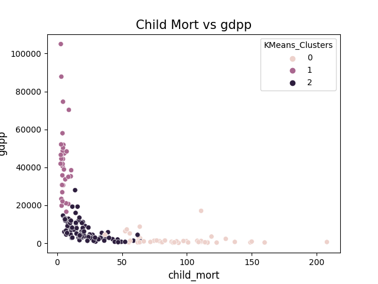
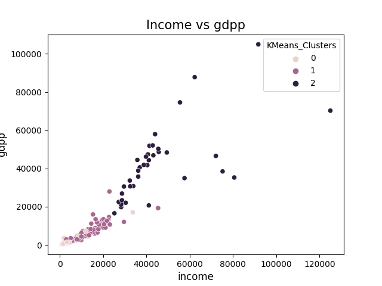
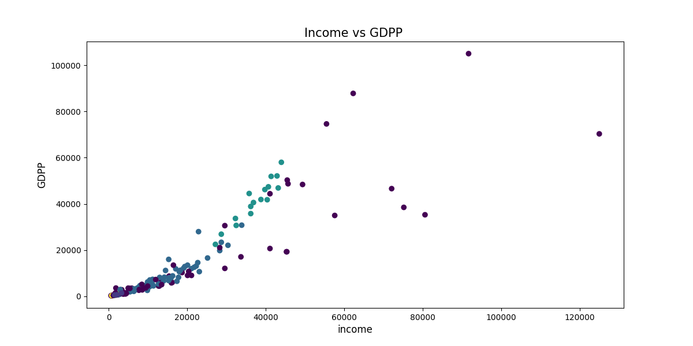

# Country Clustering
Clustering country with Kmeans, DBSCAN, and Birch

The data set was inspired from [Kaggle](https://www.kaggle.com/datasets/rohan0301/unsupervised-learning-on-country-data).
Some codes are based on the Search and work of people in the code section of the dataset page.

As we can see in this Plot

The more country GDP is, the more it is developed so based on this we can assume that based on the GDP.  

The 0 index cluster is referring to the undeveloped countries.  
The 1 index cluster is referring to the developed countries.  
The 2 index cluster is referring to the developing countries.  

We can see the same with the other Plot.  

The developed countries are the countries with the highest income, in this plot .

The index 0 is the undeveloped countries.  
The index 1 is the developing countries.  
The index 2 is the developed countries.  

The same thing can be seen in the DBscan Plot

In conclusion, any country that is in the category of underdeveloped is a good country to obtain subsidies if one wishes to establish a classification among them one can for example take the countries with the highest child mortality rate.